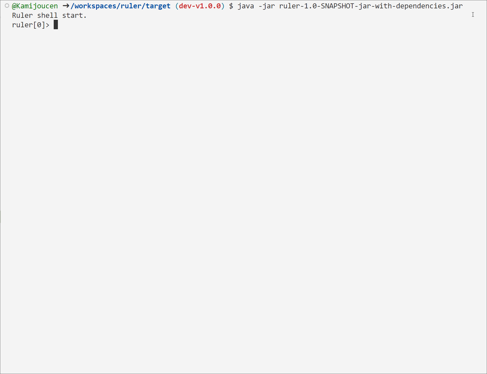

# 使用简单且可扩展的脚本引擎

## Shell
项目支持 jar 包独立运行，启动 jar 文件会创建一个运行 ruler 语法的 shell 控制台


## hello world
```java
Ruler.compileExpression("println('hello world!')", new RulerConfigurationImpl()).run();
```

```java
// 拼接脚本
StringBuffer buffer = new StringBuffer();
buffer.append("var text = 'hello world!';");
buffer.append("println(text);");
// configuration可以控制规则引擎的运行行为，通常将RulerConfiguration做成一个单例对象
RulerConfiguration configuration = new RulerConfigurationImpl();
// runner是可复用并且线程安全的，尽可能将runner缓存起来，因为执行complie有较大开销
RuleScript runner = Ruler.compileScript(buffer.toString(), configuration);
// 每次run都会产生新的执行上下文，因此runner.run线程安全
runner.run();
// 运行结果打印 hello world!
```
```java
RulerConfiguration configuration = new RulerConfigurationImpl();
RuleScript runner = Ruler.compileExpression("$name == '张三'");
// 用户自定义的参数，key就是表达式中的外部变量（$开头的变量）
Map<String, Object> args = new HashMap<String, Object>();
args.put("name", "李四");
// 运行规则，并返回运行结果
RuleResult result = runner.run(args);
// 打印规则执行结果
System.out.println(result.first().toBoolean());
// 打印 false
```

# 语法说明
## 闭包
```javascript
var b = 100;
// 函数可以作为值传递
var c = fun(a) {
    return a + b;
};
println(c(1)); // 打印 101
```
## 控制语句
```javascript
var a = 1;
var b = 10;

if a >= b {
    println("a!!!!");
} else {
    println("b!!!!");
}

while a < b {
    println("loop!", a);
    a = a + 1;
}
```
## 获取引擎外部的值

```javascript
var a = 1;
var b = $out; // $表示从外部取值
println(a + b);
```

## 自定义中缀表达式

```javascript

// 使用infix关键字定义名为 push 的中缀运算
infix fun push(array, right) {
    if typeof(array) != 'array': return array;
    array.push(right);
    return array;
}

var arr = [1, 2, 3];

// 这里的push，就是上面infix定义的函数，左右两边的值会作为函数的两个参数
arr push 4 push 5;

// 此时arr的值为 [1, 2, 3, 4, 5]
println(arr);

```

## 代理

```javascript

var a = [1, 2, 3];

// 配置代理对象
var proxyConfig = {
    get: fun(self, name) {
        if name === 'myLength' {
            return self.length() + 1;
        } else {
            return self[name];
        }
    },
    // 如果有了模式匹配可以这样写，和上面效果等同
    // get: fun(self, name) -> match(name) {
    //     case "myLength" -> self.length() + 1;
    //     _ -> self[name];
    // },

    // 也可以这样, 同时匹配了类似否是array，name是否是myLength
    // get: fun(self, name) -> match(self, name) {
    //     case array, "myLength" -> self.length() + 1;
    //     _ -> self[name];
    // },
    put: fun(self, name, newValue) {
        // ...
    }
};

// Proxy是一个内置函数，用于创建一个代理对象
a = Proxy(a, proxyConfig);

// 此时访问a上的成员，实际会执行代理配置代理对象中的get方法
println(a.myLength);

// 同理如果这样写，会进入代理配置对象中的put方法
a.myLength = 100;

```

# 未来更新计划（优先级排序）
## 重构类型系统
## 类型标注

```typescript

var a: int = $name;
var b: string = 1; // compile error!
var c: any = 123;

var d = 456; // 等价于 var d: any = 456;

fun add(a: int, b: float): float {
    return a + b;
}

var n: int = add(1, 1.0); // compile error! 返回值类型与n的标注类型不匹配

```

## 模式匹配

```typescript

var value = 'hello';
match (value) {
    case 'hello' -> println('Hello, world!');
    case 'goodbye' -> println('Goodbye, world!');
    case _ -> println('Unknown greeting');
}

var value = 42;
match (value) {
    case int(n) && 42 -> println('${n} is a number');
    case any(n) && 44 -> println('${n} is a number');
    case string(s) -> println('${s} is a string');
    case _ => println('Unknown type');
}

var numbers = [1, 2, 3, 4, 5];

match (numbers) {
    case [head | tail] => println(`Head is ${head}, tail is ${tail}`);
    case [] => println('Empty array');
    case _ => println('Not an array');
}

var a = $out;

match(a) {
    case int; [1, 2, 3] -> println();
    _ -> null;
}

```

## 分号插补
## 不可变数据类型
## 性能优化
## 优化报错信息（打印堆栈，行号等等）
## 内置标准库（网络，json，web，安全等）