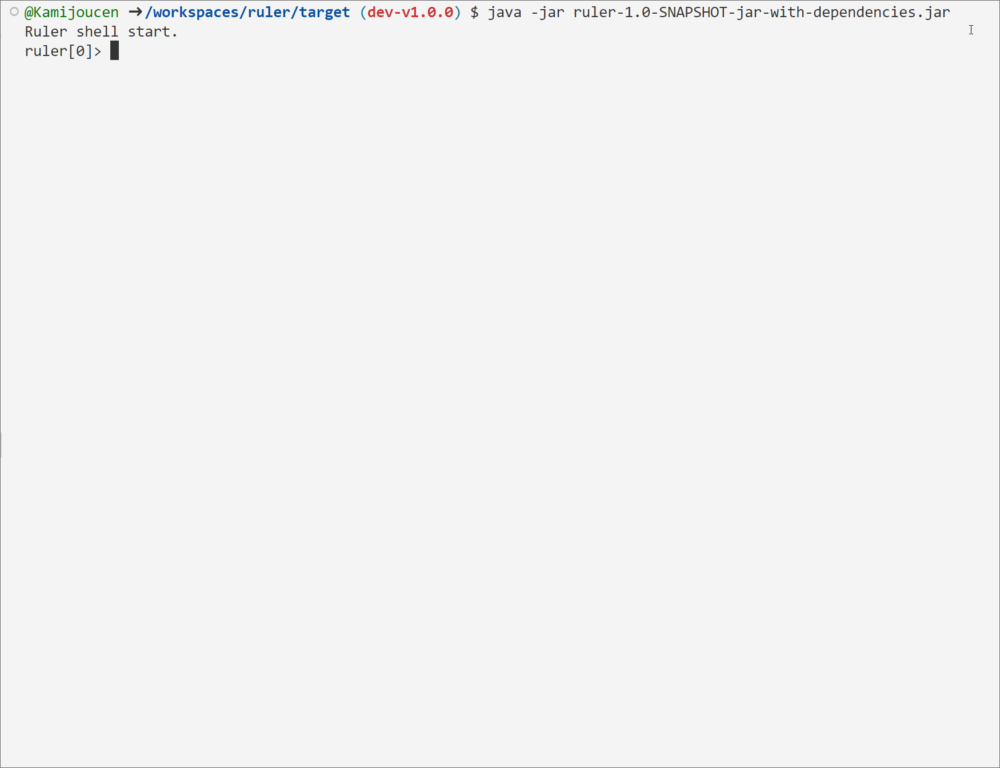

# Ruler

Ruler 是一款轻量级、可嵌入的脚本引擎，适用于 Java 宿主环境。它提供简洁的动态类型语法、闭包、数组与对象操作、中缀运算符扩展、代理以及规则块等特性。



## 核心特性

- **表达式与脚本**：`Ruler.compile(text, config)` 编译后即可求值，最后一行自动作为返回值。
- **编译期类型检查**：虽然是动态类型语言，但对字面量运算进行编译期静态检查，拦截明显错误的类型组合。
- **闭包与函数**：支持普通函数、箭头简写、闭包捕获以及中缀运算符自定义；语句末尾分号可选，换行即可作为语句结束；函数体和脚本都可以省略末尾的 `return`，最后一条语句的值会自动作为返回值。
- **数组与对象**：内置数组字面量、对象字面量（RSON）、索引访问与属性赋值。
- **字符串插值**：双引号字符串支持 `{}` 插值，单引号为原义字符串，同时支持多行块字符串。
- **代理与 self 绑定**：支持 `Proxy` 拦截对象访问，对象方法调用自动绑定 `self`。
- **规则块（Rule）**：按顺序收集多个规则块的返回值，适合规则引擎场景。
- **模块导入**：内置标准库，并支持自定义导入加载器，可从文件系统、数据库、网络等来源加载模块。
- **CLI / REPL**：提供交互式 Shell 与脚本文件执行入口。

## 快速开始

### 编译与运行

```java
var cfg = new RulerConfigurationImpl();

// 单行表达式
var runner = Ruler.compile("1 + 2 * 3", cfg);
System.out.println(runner.run().first().toInteger()); // 7

// 多行脚本
var script = "var a = 10\nvar b = 20\nreturn a + b";
var runner = Ruler.compile(script, cfg);
System.out.println(runner.run().first().toInteger()); // 30
```

### 外部参数传入

脚本中通过 `$name` 引用外部参数：

```java
var runner = Ruler.compile("$score >= 60", cfg);
var param = new HashMap<String, Object>();
param.put("score", 85);
boolean pass = runner.run(param).first().toBoolean();
```

> `RulerRunner` 在编译后可复用，且线程安全。`RulerConfiguration` 建议作为进程级单例使用。

## 编译期类型检查

Ruler 是动态类型语言，但在编译阶段会对**字面量与已推导类型**进行静态检查，提前拦截明显非法的运算组合。含未知类型变量的表达式不会报错，以兼顾动态灵活性。

### 检查规则

| 运算符 / 场景 | 允许类型 | 非法示例 |
|--------------|----------|----------|
| `+` `-` `*` `/` | 仅数值（`INT`、`DOUBLE`） | `"a" - 1`、`true + 1` |
| `>` `<` `>=` `<=` | 仅数值间比较 | `"a" > "b"`、`{a:1} > [1,2]` |
| `&&` `\|\|` | 仅 `BOOL` | `"hello" && true` |
| 一元 `+` `-` | 仅数值 | `+"abc"`、`-[1,2]` |
| 一元 `!` | 仅 `BOOL` | `!42` |
| `==` `!=` | 任意类型 | 不限制 |
| `++`（字符串拼接） | 任意已知类型 | 不限制 |
| 含变量且类型未知 | — | `1 + unknownVar`（通过） |

### 报错示例

```ruler
"hello" - "world"
// SyntaxException: operator '-' requires numeric types but got STRING and STRING at 1:9

!42
// SyntaxException: operator '!' requires BOOL but got INT at 1:1

if "notbool" { }
// SyntaxException: condition of 'if' statement must be BOOL but got STRING at 1:4
```


## 语法速览

### 变量与运算

```ruler
var a = 10
var b = 3.14
var c = "hello"
var d = true
var e = null
```

支持的运算符：
- `+` `-` `*` `/` `%`：数值运算
- `++`：字符串拼接，例如 `"a" ++ "b"` 得 `"ab"`
- `==` `!=` `<>`：非严格比较，支持类型隐式转换
- `===` `!==`：严格比较，例如 `1 === '1'` 为 `false`
- `typeof(x)`：返回类型名字符串，如 `"int"`、`"string"`、`"array"`、`"function"`

### 分号与换行

Ruler 的语句末尾分号是**可选**的，**换行即可作为语句结束符**。只有在**同一行内书写多条语句**时，才需要用分号分隔：

```ruler
var a = 1
var b = 2
return a + b

// 同一行内多语句仍需分号
var a = 1; var b = 2; return a + b
```

> 内置运算符（如 `+` `-` `*` `/` `=` 等）可以跨行使用；但**自定义中缀运算符不能跨行**，遇到换行会自动截断为独立语句，从而避免二义性。

### 控制流

```ruler
if a > b {
    println("bigger");
} else if a == b: println("equal");  // 单行简写
else {
    println("smaller");
}

while a < 10 {
    a = a + 1;
    if a == 5 { break; }
}

for item in [1, 2, 3] {
    println(item);
}
```

支持 `break`、`continue`、`return`。

### 函数与闭包

```ruler
fun add(a, b) {
    return a + b;
}

// 与 Rust 类似，也可以省略末尾的 return
fun greet(name) {
    "hello, " ++ name;
}
println(greet("ruler")); // hello, ruler

// 箭头简写
var double = fun(x) -> x * 2;

// 闭包
var base = 100;
var calc = fun(x) -> base + x;
println(calc(1)); // 101
```

> 函数体或脚本中如果没有显式 `return`，最后一条语句的求值结果会自动作为返回值；空函数或空脚本仍返回 `null`。

### 数组与对象

```ruler
var arr = [1, 2, 3];
arr.push(4);
println(arr[1]); // 2
arr[1] = 5;

var obj = {
    name: "ruler",
    age: 18,
    tags: ["script", "java"]
};
println(obj.name);
obj.age = 19;
```

### 字符串插值

```ruler
var name = "Ruler";

// 双引号支持插值
var s1 = "Hello, {name}!";        // Hello, Ruler!
var s2 = "result: {1 + 2}";       // result: 3
var s3 = "obj: { {a:1}.a }";      // obj: 1

// 单引号为原义字符串，不插值
var s4 = 'Hello, {name}!';        // Hello, {name}!

// 多行块字符串（也支持插值）
var s5 = """line1
line2 {name}
line3""";

// 转义
var s6 = "price is \{10}";        // price is {10}
```

### 中缀运算符

```ruler
infix fun push(arr, v) {
    if typeof(arr) != "array": return arr;
    arr.push(v);
    return arr;
}

var arr = [1, 2, 3];
arr push 4 push 5;
println(arr); // [1, 2, 3, 4, 5]
```

### 代理

```ruler
var arr = [1, 2, 3];
var proxyConfig = {
    get: fun(self, name) {
        if name === "myLength" {
            return self.length() + 1;
        }
        return self[name];
    },
    put: fun(self, name, newValue) {
        self[name] = newValue;
    }
};
arr = Proxy(arr, proxyConfig);
println(arr.myLength); // 4
```

### 对象方法与 self 绑定

方法调用会自动将对象绑定到第一个参数 `self`：

```ruler
var obj = {
    name: "ruler",
    getName: fun(self) { return self.name; }
};
println(obj.getName()); // ruler

var fn = obj.getName;
println(fn());          // ruler，self 仍保持绑定
```

### 规则块

```ruler
rule "score_check" {
    return $score >= 60;
}
rule "name_check" {
    return $name == "ruler";
}
```

执行结果按顺序收集每个 `rule` 的返回值。

### 导入标准库

```ruler
import "/ruler/std/collections.txt" collections;
import "/ruler/std/util.txt" util;

println(collections.Contains(1, [1, 2, 3]));
```

Java 端注册全局导入：

```java
cfg.registerGlobalImportPathModule("/ruler/std/collections.txt", "collections");
```

## CLI / REPL

```bash
# 交互式 Shell
java -jar ruler.jar

# 执行文件
java -jar ruler.jar -f=script.ruler

# 限制循环次数和栈深度
java -jar ruler.jar -f=script.ruler -maxLoopNumber=100000 -maxStackDepth=500
```

## 扩展与集成

### 自定义导入加载器

实现 `CustomImportLoader` 接口（`match(path)` + `load(path)`），并通过 `@ImportMatchOrder` 注解控制优先级。加载来源可以是文件系统、数据库、HTTP 接口等。

### SPI 扩展点

实现 `ConfigurationHook` 接口，在 `META-INF/services/com.kamijoucen.ruler.plugin.spi.ConfigurationHook` 注册。内置示例 `StdIoHook` 注入了 `io` 模块，提供 `DeleteFile()`、`WriteNewText()`、`ReadAllText()` 等函数。

## 构建

```bash
mvn -q -DskipTests compile
mvn test
mvn -Dtest=BaseTest#arrayPushTest test
```

## 注意事项

- 脚本异常会直接以 Java 异常形式抛出，由宿主代码捕获，引擎内部不提供 `try/catch` 机制。
- `RulerConfigurationImpl` 持有导入缓存，若需要环境隔离，应每次新建实例。
- 编译期类型检查仅针对已知类型（字面量或已推导变量），动态场景下仍保留运行时的类型容错行为。
